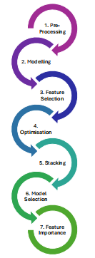
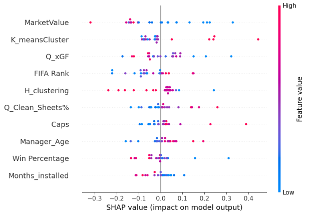

# What gives a country better international football tournament-winning odds?


## Basic Overview

This analysis will consider data from multiple sources to build, optimize and test a predictive model to identify the key features in betting odds for the European Football Championships 2024. This analysis is useful to nations looking to build teams who are considered strong contenders to win international tournaments.

## Table of Contents

1. [Installation and Set-Up](#installation-and-set-up)
2. [Data Sources](#data-sources)
3. [Data Collection](#data-collection)
4. [Data Pre-Processing](#data-pre-processing)
5. [Base Modelling](#base-modelling)
6. [Feature Selection](#feature-selection)
7. [Models on Best Features](#models-on-best-features)
8. [Model Optimization](#model-optimization)
9. [Stacking](#stacking)
10. [Feature Importance](#feature-importance)
11. [Feature Importance II](#feature-importance-ii)

## Installation and Set-Up

1. **Python Installation**: This project requires Python. Ensure you have Python installed on your system. You can download Python from the [official Python website](https://www.python.org/downloads/).

2. **Running Jupyter Notebooks**: The Python files for this project are in `.ipynb` format, which can be executed using Jupyter Notebook or Google Colab. To use Jupyter Notebook locally, you can install it via Anaconda or directly using pip:
   - **Using Anaconda**: Install Anaconda from [Anaconda's website](https://www.anaconda.com/products/distribution) and launch Jupyter Notebook from the Anaconda Navigator.
   - **Using pip**: Install Jupyter Notebook with the command:
     ```bash
     pip install notebook
     ```
     


3. **Required Packages**: This analysis requires several Python packages. You can install these packages using pip. The list of packages and their installation commands are provided below. 

      - `pip install beautifulsoup4`
      - `pip install pandas`
      - `pip install numpy`
      - `pip install matplotlib`
      - `pip install scikit-learn`
      - `pip install scipy`
      - `pip install statsmodels`
      - `pip install pygam`
      - `pip install xgboost`
      - `pip install shap`
      - `pip install mlxtend`
      
Once these packages have been installed all import statements should run.


## Data sources
Please note that Fifa Ranking and Odds Data are live data sources so hyperlinks cannot be provided. 

- FIFA Ranking: https://www.sportingnews.com/uk/football/news/fifa-rankings-euro-2024-teams-soccer-uefa-euro-championship/880ff126e23e0e4833ce8e08 
- **[Managerial Data](https://www.transfermarkt.co.uk/europameisterschaft-2024/trainer/pokalwettbewerb/EM24)**
- **[Playing Squad Data](https://www.kaggle.com/datasets/damirdizdarevic/uefa-euro-2024-players)**
- **[Historic Results](https://www.kaggle.com/datasets/martj42/international-football-results-from-1872-to-2017?select=results.csv)**
- **[Historic Titles](https://www.uefa.com/uefaeuro/history/winners/)**
- **[Qualifying Record Data](https://footystats.org/international/uefa-euro-qualifiers)**
- Odds Data: https://www.oddschecker.com/football/euro-2024/winner 

## Notebooks
The analysis is performed through several notebooks, each focusing on a specific stage. These notebooks are designed to be run in order with data being defined in earlier notebooks and imported for use in later ones:



### Data Collection
   - The data was sourced from each of the above links. The data was then summarised to contain one row for each country competing in the tournament.
   - This data was ordered alphabetically by country to allow for easier merging. Once the data was consistently formatted it was merged on 'Country'. This meant that the final dataset had a single row containing a Country's:
     
         1. Nation (Team)
     
         2. Nation Ranking (FIFA Rank)
     
         3. Tournament Odds (Odds_to_One)
     
         4. Manager Statistics (Manager, Manager_Age, Contract until, Months_installed)
     
         5. Nation Tournament Wins (Titles)
     
         6. Playing Squad Data (Age, Height, Caps, Goals, MarketValue, Win Percentage)
     
         7. Qualifying Team Data (Q_GF, Q_GA, Q_PPG_Last_5, Q_Clean_Sheets, Q_xGF)

   - This Dataframe was saved and passed onto the pre-processing stage.

### Data Pre Processing
   - The merged dataframe from before is pre-processed to allow for smoother exploration and further analysis.
   - Data types are changed, data is explored and clustered. Finally, a processed dataset is saved for use in later files.

### Base Modelling
   - The pre-processed data is split into train and test sets.
   - A range of regression models are initialized and run with their standard hyperparameters.
   - Performance metrics are collected for each of the models. These metrics serve as a benchmark for further models that undergo Feature Selection/Optimization/Stacking.

### Feature Selection
The data underwent feature selection. This refers to collecting a subset of features that best encapsulate the target feature. This was done using both the Forward and Backward techniques.

### Models on Best Features
The same base models that were run before were run on the dataset with reduced features. This gives an indication of how well this subset of best predictors can predict the target feature. If there is no significant change in model performance, you may suggest that only the best predictors are necessary for modelling therefore reducing data collecting times in subsequent analyses.

### Model Optimization
The previously defined models will have their hyperparameters tuned in order to improve performance. This was done through the use of Grid Search. While this is not an exhaustive method, it allows for the optimization for the large quantity of models in the analysis. If wanting to re-run this analysis one could choose to use a more exhaustive grid search or an alternative optimization method.

### Stacking
This analysis segment will focus on stacking the optimized models. Stacking is an ensemble method that combines the predictive power of multiple models to generate a new model. This can often lead to improved model results.

### Feature Importance
This analysis segment will focus on feature importance. It will consider each of the best performing models from all previous model stages. The best model will be identified and re-tested. Once the model is tested, feature importance will be run. This will be done using the SHAP (SHapley Additive exPlanations) tools. This segment of the analysis answers the core of the initial resource question: 'What gives a country better international football tournament-winning odds?'. The SHAP output, shown below, shows the feature importance ranking and the traits of these features that lead to certain predictions. 



### Feature Importance II
This notebook will look further into Feature Importance. The previous FI notebook had anonymised the data where countries were considered as one rather than individually. While that works for general conclusions, this notebook will focus more on the impact of simply the country and no external factors and the effect that has on their tournament winning odds.
